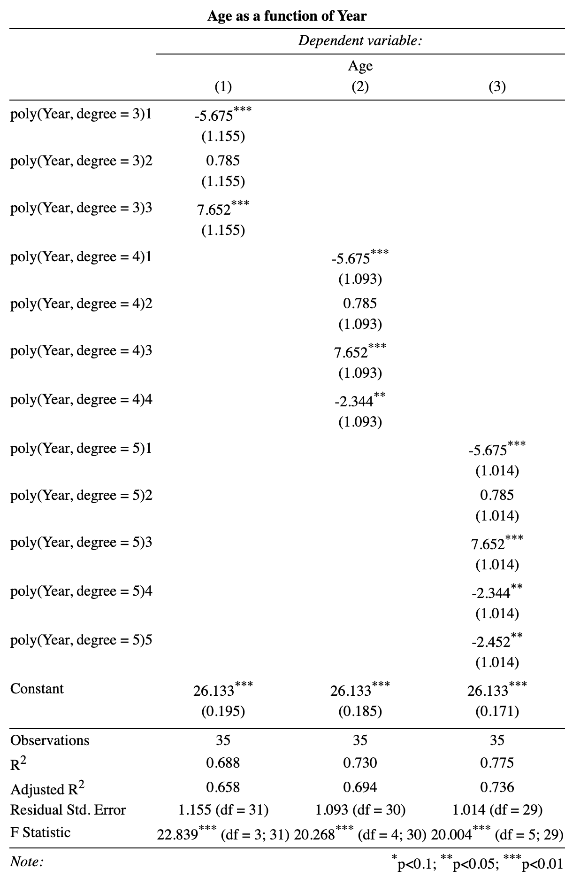

```{r}
# Libraries
library(tidyverse)
library(gtable)
library(grid)
library(lattice)
library(gridExtra)
library(stargazer)

# Data
athlete_events <- read.csv("~/ds202/final_project/athlete_events.csv")
```

```{r}
winter_years <- c(unique(athlete_events$Year[athlete_events$Season == "Winter"]))
num_noc_per_year <- athlete_events %>%
  group_by(Year) %>%
  summarise(num_noc_per_year = length(unique(NOC))) %>%
  mutate(winter_sports = ifelse(Year %in% winter_years, 1, 0)) %>%
  mutate(summer_post_break = ifelse(Year >= 1996 & (2016 - Year) %% 4 == 0, 1, 0)) %>%
  mutate(winter_post_break = ifelse(Year >= 1994 & (2018 - Year) %% 4 == 0, 1, 0)) %>%
  mutate(pre_winter = ifelse(Year <= 1920, 1, 0)) %>%
  mutate(combined_olympics = ifelse(pre_winter == 0 & Year <= 1992, 1, 0)) %>%
  mutate(olympic_type=case_when(
    (summer_post_break == 1) ~ "summer",
    winter_post_break == 1 ~ "winter",
    pre_winter == 1 ~ "pre-winter",
    combined_olympics == 1~ "both"
  ), olympic_type = as.factor(olympic_type))

type <- ggplot(data = num_noc_per_year, aes(olympic_type, fill = olympic_type)) + 
  geom_bar(stat = "count") +
  ggtitle("Number of Each Type of Olympics")
type

density <- ggplot(data = num_noc_per_year, aes(num_noc_per_year, group = as.factor(olympic_type), color = as.factor(olympic_type), linetype = as.factor(olympic_type))) + stat_ecdf(geom = "step") + theme_classic() + xlab("Number of Participants") + ylab("Empirical cumulative probability") + ggtitle("Cumulative Density Plot")
density

# plot time series
olym_timeseries <- ggplot(data = num_noc_per_year, aes(x = Year, y = num_noc_per_year, group = as.factor(olympic_type), color = as.factor(olympic_type))) + 
  geom_line() + 
  geom_vline(xintercept = 1993) +
  geom_vline(xintercept = 1924) +
  annotate("text", x = 1976, y = 200, label = "Split to Separate 
Summer and Winter", size = 3) + 
  ylab("Number of Countries Participating") +
  annotate("text", x = 1937, y = 125, label = "Introduction of 
Winter Games", size  =3) +
  theme_minimal()

olym_timeseries
```


```{r}
#looking at the average age by year
athlete_events_age <- athlete_events %>%
  group_by(Year) %>%
  summarise(age = mean(Age[!is.na(Age)]))

#plot for this
avg_age <- ggplot(data = athlete_events_age, aes(x = as.factor(Year), y = age)) + 
  geom_histogram(stat = "identity", bins = 35) +
  theme(axis.text.x = element_text(angle = 90)) +
  xlab("Year") + ylab("Average Age of Olympian")
ggsave(filename = "avg_age.png", avg_age, path = "~/Downloads/")

#looking at the average age by season
athlete_events_season <- athlete_events %>%
  group_by(Season) %>%
  summarise(Age = mean(Age[!is.na(Age)]))

#plot for this
ggplot(data = athlete_events_season, aes(x = Season, y = Age, fill = Season)) + 
  geom_histogram(stat = "identity") +
  theme(axis.text.x = element_text(angle = 90)) +
  xlab(" ") + ylab("Average Age of Olympian")


#t test for the difference between summer and winter
t.test(athlete_events$Age[athlete_events$Season == "Summer" & !is.na(athlete_events$Age)],
       athlete_events$Age[athlete_events$Season == "Winter" & !is.na(athlete_events$Age)])

#we see a statistically significant result but not a practically different gap in age.

#setting up and plotting age as a function of year in ols with a cubic model
lm.deg3 <- lm(data = athlete_events_age, formula = age ~ poly(Year, degree = 3))

p.lm.deg3 <- ggplot(data = athlete_events_age, aes(x = Year, y = age)) + 
  geom_point() +
  geom_smooth(method = "lm", formula=y~I(x^3)+I(x^2))


#setting up and plotting age as a function of year in ols with a fourth degree model
lm.deg4 <- lm(data = athlete_events_age, formula = age ~ poly(Year, degree = 4))

p.lm.deg4 <- ggplot(data = athlete_events_age, aes(x = Year, y = age)) + 
  geom_point() +
  geom_smooth(method = "lm", formula=y~I(x^4)+I(x^3)+I(x^2))

#setting up and plotting age as a function of year in ols with a fifth degree model
lm.deg5 <- lm(data = athlete_events_age, formula = age ~ poly(Year, degree = 5))

p.lm.deg5 <- ggplot(data = athlete_events_age, aes(x = Year, y = age)) + 
  geom_point() +
  geom_smooth(method = "lm", formula=y~I(x^5)+I(x^4)+I(x^3)+I(x^2))

p.lm.deg3;p.lm.deg4;p.lm.deg5
```

```{r, eval=F}
stargazer(lm.deg3, lm.deg4, lm.deg5, title="Age as a function of Year", align=TRUE,
          type = "html", 
          out = "~/ds202/final_project/regression_output_zack.html",
          dep.var.labels = "Age")
```


